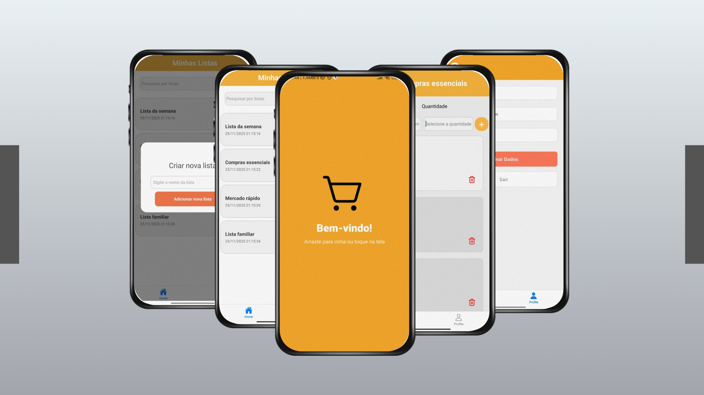

## React: Lista de Compras


## Projeto Aula - Lista de Compras
Uma aplicação simples para gerenciar itens de uma lista de compras.



## 🔨 Funcionalidades do Projeto
Nesta parte do projeto desenvolvemos:  
* Tela **Home** para visualização dos itens.  
* Adição e remoção de produtos na lista.  
* Barra de pesquisa para buscar por listas.  
* Tela de **Perfil** para gerenciamento de informações do usuário.  
* Tela de **Detalhes** ao clicar em uma lista específica.     

## ✔️ Técnicas e Tecnologias Utilizadas
Durante esse projeto utilizamos:  
* React Native 
* JavaScript (ES6+)  
* Node.js
* React Navigation
* Expo
  
## 🎨 Link do Figma
Para visualizar o Figma do projeto, clique [Clique aqui para visualizar o design do projeto](https://www.figma.com/proto/aj0R8oGqJnOMvoSkEK6RPt/Prot%C3%B3tipo?node-id=660-2153&t=6WdTSAZ5UBSNrQXJ-1&scaling=min-zoom&content-scaling=fixed&page-id=0%3A1&starting-point-node-id=660%3A2041&show-proto-sidebar=1)

## 🚀 Como Executar o Projeto
```
# Clonar o repositório
git clone https://github.com/MateusRCz/projeto-aula-lista-de-compras.git

# Entrar na pasta do projeto
cd nome-do-projeto

# Instalar dependências
npm install

# Executar o app
npx expo start
```
